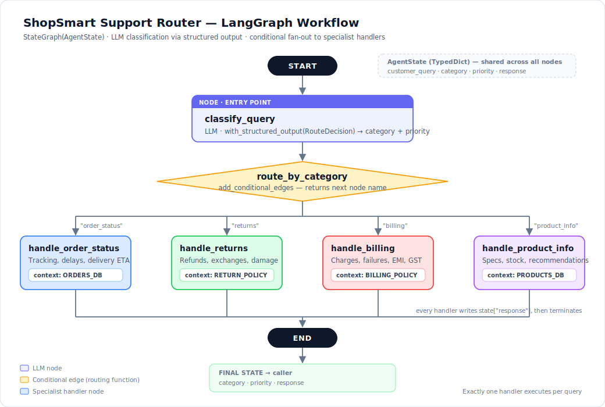

# 🛒 ShopSmart Customer Support System

### An AI assistant that reads customer complaints and instantly sends each one to the right department.

Think of it as a **smart receptionist for a customer service team.** When a customer writes in, the AI reads the message, works out what it's actually about, decides how urgent it is, and hands it to the right specialist — in seconds, instead of hours.

<p>
  
  
  
  
</p>

---

## 👀 See it in 10 seconds

A customer sends an angry message. Here's what the system does with it, unassisted:

> **Customer writes:**
> *"I was charged twice for my MacBook Air order! ₹1,14,900 was deducted two times from my credit card."*

**The AI figures out:**

| | |
|---|---|
| 🏷️ **What it's about** | Billing |
| 🚨 **How urgent** | **High** — real money is missing |
| 👤 **Who should handle it** | The billing specialist |

**And it writes back:**

> *"I'm really sorry about the double charge — that's understandably alarming for an amount like ₹1,14,900. Duplicate charges must be reported within 48 hours for immediate reversal, so please raise this now from Order Details → Report an Issue. Once flagged, the duplicate amount is reversed to your original credit card, typically within 3–5 business days."*

Notice it didn't just guess — it quoted the **actual company refund policy**. That's because it was routed to the billing expert, who has the billing rulebook. A generic chatbot would have made something up.

---

## 🎯 The problem I set out to solve

*(The company here — "ShopSmart" — is a fictional Indian online store, used as a realistic scenario.)*

ShopSmart gets **50,000 customer complaints every single day.** Right now, humans read each one and pass it along. That breaks down badly:

| What goes wrong | Why it hurts |
|---|---|
| 😵 **1 in 3 messages goes to the wrong team** | The customer waits an extra 2–3 hours while it gets passed around. |
| 🐌 **First reply takes 4+ hours** | At night the backlog hits 500+ waiting customers. |
| 🎲 **Urgency is guessed, not measured** | A lost ₹50,000 delivery is marked "normal," while a polite product question gets marked "urgent" because it *sounded* angry. |
| 🤷 **Everyone handles everything** | A payments expert wastes 15 minutes looking up return rules they don't know. |

**My goal:** replace that first sorting step entirely with AI — no human needed to decide where a message goes.

---

## 💡 What I built

The system works like a **hospital triage nurse.** It doesn't treat you — it works out what's wrong and sends you to the right doctor, fast.

Every message goes through **three steps**:

### 1️⃣ Read and understand it
The AI reads the message and sorts it into one of four buckets:

🚚 **Order Status** · ↩️ **Returns** · 💳 **Billing** · 📦 **Product Questions**

It also rates the urgency (**low / medium / high**) using a written rulebook, not gut feeling — *"money is missing" is always high; "which headphones are better?" is always low.*

### 2️⃣ Send it to the right specialist
This is the clever part. Instead of one chatbot that half-knows everything, I built **four separate experts**, each with only their own knowledge:

| Specialist | Knows about | What they can see |
|---|---|---|
| 🚚 **Delivery expert** | Tracking, delays, arrival dates | The order database |
| ↩️ **Returns expert** | Refunds, exchanges, damaged items | The returns rulebook |
| 💳 **Billing expert** | Wrong charges, failed payments, EMI | The payments rulebook |
| 📦 **Product expert** | Prices, stock, recommendations | The product catalogue |

Only **one** expert ever wakes up per message. The other three never see it.

### 3️⃣ Write the reply
The chosen expert writes a helpful, specific answer using its own rulebook — then the message is done.

---

## 🗺️ The workflow, as a picture



Read it top to bottom: a message arrives, the AI classifies it, the diamond in the middle is the **decision point**, and the message drops down exactly **one** of the four coloured paths.

---


## 🛠️ Skills this project demonstrates

| Skill | Where you can see it |
|---|---|
| **AI workflow design (LangGraph)** | Building a multi-step system where AI *decisions* change the path taken — not just a single question-and-answer |
| **Reliable AI output** | Forcing the AI to answer in a strict, machine-readable format so it *cannot* return a nonsense category — a common production failure |
| **Prompt engineering** | Five separate prompts, each with its own persona, rules, and knowledge |
| **Grounding AI in real data** | Answers are built from a real order database and policy documents, which sharply reduces the AI inventing facts |
| **Clean software engineering** | Refactored from a notebook into a proper package — separate files for data, prompts, logic, and wiring |
| **Product thinking** | Started from a business cost (35% misroutes, 4-hour waits), not from the technology |

---


## 📁 What's in this repo

```
shopsmart-support-router/
├── README.md                 ← you are here
├── requirements.txt          ← the libraries this needs
├── docs/
│   └── workflow.svg          ← the diagram above
└── src/
    ├── state.py              ← what information travels through the system
    ├── data.py               ← the orders, products, and policy rulebooks
    ├── prompts.py            ← the instructions given to the AI
    ├── nodes.py              ← the classifier and the four specialists
    ├── graph.py              ← how it's all wired together
    └── main.py               ← the run button
```

---

